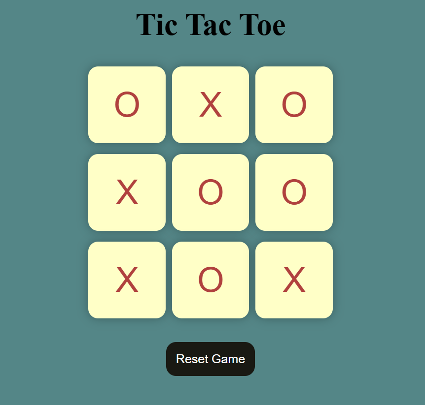

# 🎮 Tic-Tac-Toe Game

A simple **Tic-Tac-Toe** game built using **HTML, CSS, and JavaScript**. Play against a friend in this classic game and have fun! 🏆  

---

## 🚀 Features
✔️ **Interactive UI** – Simple and clean design.  
✔️ **Two-player mode** – Play with a friend.  
✔️ **New Game Feature** – Start a fresh game with one click.  
✔️ **Game Reset Option** – Restart the game anytime.  
✔️ **Fully Responsive** – Works on mobile and desktop.  

---

## 🛠️ Technologies Used
- **HTML** – Structure of the game  
- **CSS** – Styling and layout  
- **JavaScript** – Game logic and interactions  

---

## 🎮 How to Play
1. The game starts with **Player O** by default.  
2. Players take turns placing "X" and "O" in empty boxes.  
3. The first player to form a row, column, or diagonal wins.  
4. If all boxes are filled without a winner, it's a **draw**.  
5. Click the **Reset** button to play again.  
6. Click the **New Game** button to start a fresh game.  

---

## 📸 Screenshots

---

## 📂 How to Run the Project Locally
1️⃣ **Clone the repository**  
git clone https://github.com/vinit9021/tic-tac-toe.git

2️⃣ Navigate to the project folder
cd tic-tac-toe

3️⃣ Open index.html in a browser